```{r setup, include=FALSE}
options(htmltools.dir.version = FALSE)
```
background-image: url(https://upload.wikimedia.org/wikipedia/commons/c/c1/Rlogo.png)
???

Image credit: [Wikimedia Commons](https://commons.wikimedia.org/wiki/File:Rlogo.png)
---
class: inverse, center, middle

#ENTER
#R Workshop: part I
##Tatjana Kecojevic
##26 April 2018
---
class: inverse, center, middle

Go to [https://github.com/TanjaKec/EnterConf_R_Workshop](https://github.com/TanjaKec/EnterConf_R_Workshop) to download the material.

```{r, out.width = "500px", echo=FALSE, fig.align='center'}
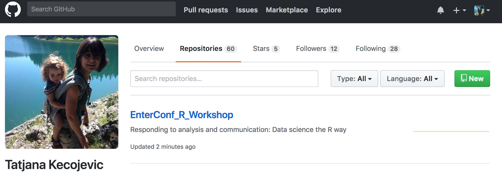
```

```{r, out.width = "400px", echo=FALSE, fig.align='center'}
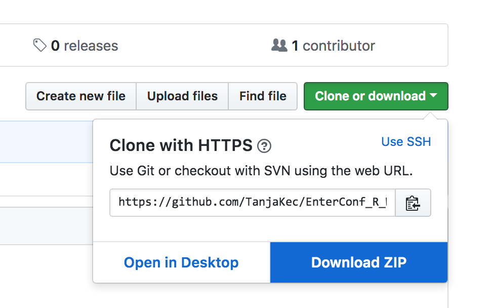
```


---
class: center, middle

#How do we do it? 🤔

###Steps of a typical data science project:
```{r, out.width = "500px", echo=FALSE}
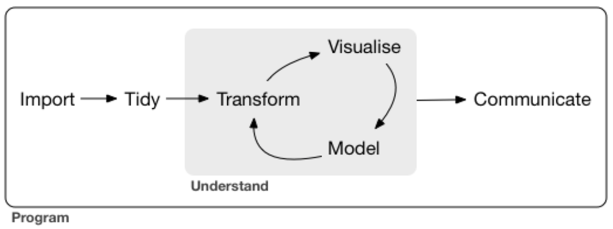
```
---
class: inverse, center, middle

#Get Started 🤫😴
```{r, out.width = "600px", echo=FALSE}
knitr::include_graphics("George_Desk.gif")
```
---
##Before there was R, there was S! 🤠

**R** is a dialect of **S** language that was developed in 1976 by *Rick Becker* and *John Chambers* at the  Bell Laboratories.

*Rick Becker* gave an excellent keynote talk *"Forty Years of S"* at UseR!2016 conference:   
[Rick Becker @ UseR!2016](http://blog.revolutionanalytics.com/2016/07/rick-becker-s-talk.html) where he talked about development of **S** language that gives explanations for many characteristics of **R** as we know it, including "<-" assignment operator.

1993 Bell Labs gave StatSci (later Insightful Corp.) an exclusive license to develop and sell the **S** language. Insightful sold its implementation of the **S** language under the product name **S-PLUS**.

You can read more about the [history of S, R, and S-PLUS](https://www.whoishostingthis.com/resources/s-plus/)
---
## then, R was born 😇🎶
In early nineties at the University of Aucklandn in the Department of Statistics **R** was created by *Ross Ihaka* and *Robert Gentleman*.

They used [GNU General Public License](http://www.gnu.org/licenses/gpl-2.0.html) to make R open source free software. 

**R**oss Ihaka and **R**obert Gentleman. *R: A language for data analysis and graphics.* Journal of Computational and Graphical Statistics, 5(3):299–314, 1996

Currently **R** is developed by the **R Development Core Team**, of which *John Chambers* is a member.
---
##Write R Code

To start using **R** you need to:

1) Install [R](https://cran.r-project.org/) [(and RStudio)](https://www.rstudio.com/products/rstudio/download/#download)

2) Launch it and set your working directory: letting R know where to find all of your files.

3) Start writing **R** code!

**Tip**💡:
- When start working on a new R code/R Project in [RStudio IDE](https://support.rstudio.com/hc/en-us/sections/200107586-Using-the-RStudio-IDE) use 
***File -> New Project*** 
This way your working directory would be set up when you start a new project and it will save all your files in it. Next time you open your project it would set project's directory as a working directory... It would help you with so much [more](https://support.rstudio.com/hc/en-us/articles/200526207-Using-Projects). 
---
class: center, middle

##[RStudio IDE Cheatsheet](https://www.rstudio.com/wp-content/uploads/2016/01/rstudio-IDE-cheatsheet.pdf)

```{r, out.width = "500px", echo=FALSE}
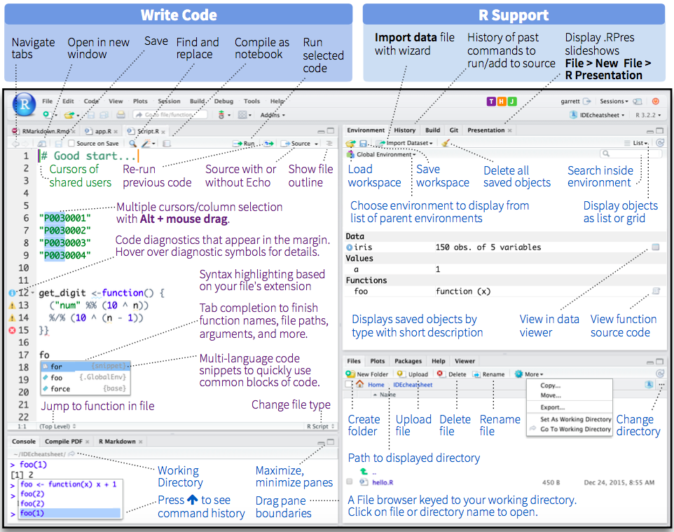
```

***Top Left:*** Code Editor;
--

***Bottom Left:*** R Console;
--

***Top Right:*** Environment
--

***Bottom Right:*** Plots and Files
---
##Dataset

**gapminder** dataset available from **gapminder** package.
For each of 142 countries, the package provides values for life expectancy, GDP per capita, and population, every five years, from 1952 to 2007.

```{r tidy=FALSE, echo = FALSE}

DT::datatable(head(gapminder::gapminder, 4))

```

Note thet there are 6 columns, each of which we call a **variable**. 
---
class: inverse, center, middle
  
  # Let's get introduced to some basic statistical concepts 🧐
---
##What will I learn in Part I?

During Part I of the workshop you will be introduced to a set of methods that enable data to be explored using `R` with the **objective** 
- of summarising and understanding the main features of the variables contained within the data and 

- to investigate the nature of any linkages between the variables that may exist.

The starting point is to understand **what data is**.
- What is the **population**?
- Why do we use **samples**?

So, from where do I start?

- **Do I understand the problem** under investigation and are the objectives of the investigation clear? *The only way to obtain this information is to ask questions, and keep asking questions until satisfactory answers have been obtained.*

- Do I understand exactly **what each variable is measuring/recording?**
---
#Describing Variables

A starting point is to examine the characteristics of each individual variable in the data set. 

The way to proceed depends upon the type of variable being examined.

**Classification of variable types**

The variables can be one of two broad types:

-	Attribute variables 

-	Measured variables
.pull-left[
**attribute**

gender

days in a week
]
.pull-right[
**measured**

age

weight
]
---
##The Concept of Statistical Distribution

**The concept of the statistical distribution is central to statistical analysis.**

This concept relates to the population and conceptually assumes that we have perfect information, the exact composition of the population is known. 

.pull-left[
**attribute:**
```{r tidy=FALSE, echo=FALSE}
barplot(c(5,9),
	names.arg=c("Category 1","Category 2"),
	ylim=c(0,10),
	col=c("#CDB79E","darkolivegreen3"),
	ylab="Count of items")
```
]

.pull-right[
**measured:**
```{r tidy=FALSE, echo=FALSE}
x<-seq(-3,3,length=200)
s = 1
mu = 0
y <- (1/(s * sqrt(2*pi))) * exp(-((x-mu)^2)/(2*s^2))
plot(x,y, type = "l", lwd = 2, axes = FALSE, xlab = "", ylab = "")
axis(1, at = -3:3, labels = c("-3", "-2", "-1std", "mean", "1std", "2", "3"))
abline(v = 0, col="red", lwd=2, lty=2)
abline(v = c(-1,1), col="blue", lwd=2, lty=3)
```
]
---
class: center, middle
##Summary Statistics

```{r echo=FALSE, tidy=FALSE}
nf <- layout(mat = matrix(c(1,2),2,1, byrow=TRUE),  height = c(3,1))
xseq<-seq(-4,4,.01)
densities<-dnorm(xseq, 0,1)
par(mar=c(3.1, 3.1, 1.1, 2.1))
plot(xseq, densities, col="darkgreen",xlab="", ylab="Density", type="l",lwd=2, cex=2, main="PDF of Standard Normal", cex.axis=.8, axes = FALSE)
axis(1, at = -4:4, labels = c("min", "-3", "Q1", "-1", "median", "1", "Q3", "3", "max"))
abline(v = 0, col="red", lwd=2, lty=2)
abline(v = c(-2,2), col="blue", lwd=2, lty=3)
abline(v = c(-4,4), col="black", lwd=2, lty=3)
boxplot(xseq, horizontal=TRUE,  outline=TRUE,ylim=c(-4,4), frame=F, col = "darkolivegreen3", width = 10)
```
---
##Investigating relationship between variables

One of the key steps required of the Data Analyst is to investigate the relationship between variables. This requires a further **classification of the variables** contained within the data, as either a <span style="color:darkred">**response**</span> variable or an <span style="color:darkred">**explanatory**</span> variable.  

A **response** variable is a variable that measures either directly or indirectly the objectives of the analysis.

An **explanatory** variable is a variable that may influence the response variable.
---
class: center, middle
##Bivariate Relationships
```{r, out.width = "500px", echo=FALSE}
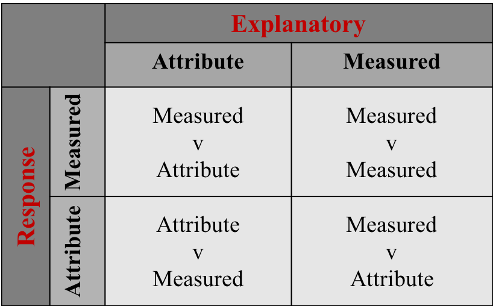
```
---
class: center, middle
##DA Methodology
```{r, out.width = "600px", echo=FALSE}
knitr::include_graphics("DaMethodology.png")
```

Note that the 'Further Data Analysis' stage may or may-not be required depending on the outcome of the 'Initial Data Analysis' at stage 1. 
---
class: center, middle
##Measured Vs Attribute(2-levels)
```{r, out.width = "700px", echo=FALSE}
knitr::include_graphics("MvAMethodology.png")
```
---
class: center, middle
##Measured Vs Measured
```{r, out.width = "700px", echo=FALSE}
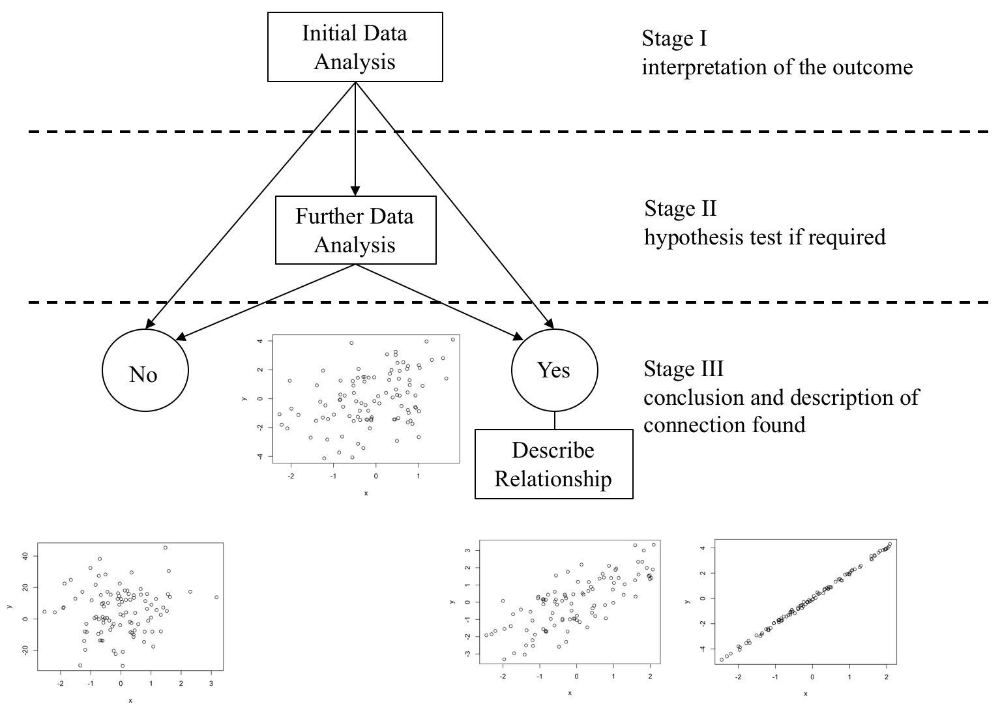
```
---
##Further Data Analysis

If the <span style="color:darkblue">'**Initial Data Analysis**'</span> is <span style="color:darkblue">*inconclusive*</span> then <span style="color:darkblue">'**Further Data Analysis**'</span> is required. 

The 'Further Data Analysis' is procedure that enables a decision to be made, based on the sample evidence, as to one of two outcomes:  
- There is no relationship
-	There is a relationship

These statistical procedures are called <span style="color:darkred">**hypothesis tests**</span>, which essentially <span style="color:darkred">*provide a decision rule for choosing between one of the two outcomes*</span>: "There is no relationship" or "There is a relationship" based on the sample evidence.

All hypothesis tests are carried out in four stages:
- Stage 1:		Specifying the hypotheses.

- Stage 2:		Defining the test parameters and the decision rule.

- Stage 3:		Examining the sample evidence.

- Stage 4:		The conclusions.
---
##Statistical Models used in FDA

* Measured Response v Attribute Explanatory Variable with exactly two levels:
  
  - t-test

* Measured Response v Attribute Explanatory Variable with more than two levels:
  
  - One-Way ANOVA
  
* Measures Response v Measured Explanatory Variable
  
  - Simple Regression Model
  
* Measures Response v Measured Explanatory Variable**s**
  - Multifactor Regression Model

* Attribute Response v Attribute Explanatory Variable
  - Chi-Square Test of Independence
---
class: inverse, center, middle
  
#How do we do it in R? 🤓
---
##Before Tidyverse R, there is Base R!
When you download and install **R** for the first time, you are installing **the Base R** software. **Base R** contains most of the functions you’ll use on a daily basis: `mean()`, `subset()`...

To learn about **R**'s basic operations, data structures and base functions you could look at one of the R-Ladies Manchester's handouts: [Introduction to base R](https://tanjakec.github.io/blog/introduction-to-r/).

If you want to access data and code written by other people, you’ll need to install it as a **package**. An **R package** is a bundle of functions (code), data, documentation, vignettes (examples), stored in one neat place.

"In **R**, the fundamental unit of shareable code is the package." [Hadley Wickham](http://r-pkgs.had.co.nz/intro.html)  
---
##The verse! 😇🎶
An opinionated collection of **R packages** for data science.

[`install.packages("tidyverse")`](https://www.tidyverse.org/)

[`library(tidyverse)`](https://www.tidyverse.org/packages/)

- Have you tried learning data science by reading books? 

📖📘 [**R for Data Science**](http://r4ds.had.co.nz/) by Garrett Grolemund & Hadley Wickham

- Have you tried learning data science by posting your questions and discussing it with other people within the R community?

👥💻📊📈🗣 [**RStudio Community**](https://community.rstudio.com/)
---
##The <span style="color:blue">`dplyr`</span> Package: 
provides a “grammar” (the verbs) for data manipulation and for operating on data frames. The **key opertor and the esential verbs** are :

- <span style="color:blue">`%>%`</span>: **the “pipe” operator** used to connect multiple verb actions together into a pipeline.

- <span style="color:blue">`select()`</span>: return a subset of the columns of a data frame.

- <span style="color:blue">`mutate()`</span>: add new variables/columns or transform existing variables.

- <span style="color:blue">`filter()`</span>: extract a subset of rows from a data frame based on logical conditions.

- <span style="color:blue">`arrange()`</span>: reorder rows of a data frame according to single or multiple variables.

- <span style="color:blue">`summarise()`</span> / <span style="color:blue">`summarize()`</span>: reduces each group to a single row by calculating aggregate measures. 
---
##Gapminder Data

Excerpt of the Gapminder data on life expectancy, GDP per capita, and population by country.

The main data frame gapminder has **1704 rows** and **6 variables**:
- **country**: factor with 142 levels
- **continent**: factor with 5 levels
- **year**: ranges from 1952 to 2007 in increments of 5 years
- **lifeExp**: life expectancy at birth, in years
- **pop**: population
- **gdpPercap**: GDP per capita

```{r tidy=FALSE}
gapminder::gapminder[1:3,]
```
---
class: center 

##Setting up Working Environment 💡

.pill-left[
Install necessary packages you will be working with!

```{r eval=FALSE}
install.packages("dplyr", repos = "http://cran.us.r-project.org")
install.packages("ggplot2", repos = "http://cran.us.r-project.org")
install.packages("gapminder", repos = "http://cran.us.r-project.org")
```
]

--
Now we're ready to start practicing Elain's Dance!!! 😃🎵🎶

```{r, out.width = "300px", echo=FALSE}
knitr::include_graphics("ElainDanceI.png")
```
---
## 1st look at the data: <span style="color:blue">`dim()`</span> & <span style="color:blue">`head()`</span>

```{r, warnings=FALSE, message=FALSE}
library(gapminder)
dim(gapminder)
head(gapminder, n=10)
```
---
##Examine the structure of the data: <span style="color:blue">`str()`</span>
```{r}
str(gapminder) 
```

The **output could look messy** and it might not fit the screen when dealing with a big data set that has lots of variables! 🤪
---
##Do it in a tidy way: <span style="color:blue">`glimpse()`</span>

```{r, warnings=FALSE, message=FALSE}
suppressPackageStartupMessages(library(dplyr))
glimpse(gapminder) 
```
---
##The pipeline operater: <span style="color:blue">`%>%`</span>
<pre>
**Left Hand Side (LHS)**   <span style="color:blue">`%>%`</span>    **Right Hand Side (RHS)**
</pre>
<pre>
<span style="color:blue">x %>% f(..., y)</span> 

<span style="color:blue">    f(x,y)</span>
</pre>

The "pipe" passes the **result** of the **LHS** as the 1st operator argument of the **function** on the **RHS**

<pre>
<span style="color:blue">3 %>% sum(4)</span>      <==>      <span style="color:blue">  sum(3, 4)</span>
</pre>

<span style="color:blue">`%>%`</span> is very practical for chaining together multiple <span style="color:blue">`dplyr`</span> functions in a sequence of operations.
---
##pick variables by their names: <span style="color:blue">`select()`</span>,
```{r, out.width = "450px", echo=FALSE}
knitr::include_graphics("select().png")
```

- <span style="color:blue">`starts_with("X")`</span> every name that starts with "X".

- <span style="color:blue">`ends_with("X")`</span> every name that ends with "X".

- <span style="color:blue">`contains("X")`</span> every name that contains "X".

- <span style="color:blue">`matches("X")`</span> every name that matches "X", where "X" can be a regular expression.

- <span style="color:blue">`num_range("x", 1:5)`</span>  the variables named x01, x02, x03, x04, x05.

- <span style="color:blue">`one_of(x)`</span> => every name that appears in x, which should be a character vector.
---
##Select your variables
1) that ends with letter `p`

2) starts with letter `o`. Try to do this selection using base R.  
---
##Solutions:
```{r, echo = TRUE}
gm_pop_gdp <- select(gapminder, ends_with("p"))
head(gm_pop_gdp, n = 1)
gm_cc <- select(gapminder, starts_with("co"))
head(gm_cc, n = 1)
```
of course all of this could be done using **base R** like for example:
```{r, echo = TRUE}
gm_cc <- gapminder[c("country", "continent")]
```
but it's less intuitive and often requires more typing. 
---
##Create new variables of existing variables: <span style="color:blue">`mutate()`</span>
```{r, out.width = "400px", echo=FALSE}
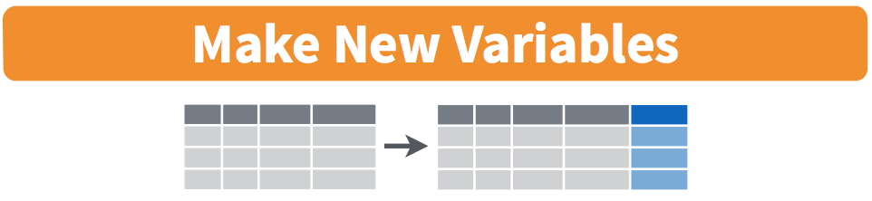
```

It would allow you to add to the data frame `df` a new column, `z`, which is the multiplication of the columns `x` and `y`: `mutate(df, z = x * y)`.
If we would like to observe `lifeExp` measured in months we could create a new column `lifeExp_month`: 
```{r, echo = TRUE}
gapminder2 <- mutate(gapminder, LifeExp_month = lifeExp * 12) 
head(gapminder2, n = 2)
```
---
##Pick observations by their values: <span style="color:blue">`filter()`</span>
```{r, out.width = "450px", echo=FALSE}
knitr::include_graphics("filter().png")
```

There is a set of logical operators in **R** that you can use inside `filter()`:

- `x < y`: `TRUE` if `x` is less than `y`
- `x <= y`: `TRUE` if `x` is less than or equal to `y`
- `x == y`: `TRUE` if `x` equals `y`
- `x != y`: `TRUE` if `x` does not equal `y`
- `x >= y`: `TRUE` if `x` is greater than or equal to `y`
- `x > y`: `TRUE` if `x` is greater than `y`
- `x %in% c(a, b, c)`: `TRUE` if `x` is in the vector `c(a, b, c)`
- `is.na(x)`:  Is `NA`
- `!is.na(x)`: Is not `NA`
---
##Filter your data:

Use `gapminder2` `df` to filter:

1) only Europian countries and save it as `gapmEU`

2) only Europian countries from 2000 onward and save it as `gapmEU21c`

3) rows where the life expectancy is greater than 80

Don't forget to **use `==` instead of `=`**! and
Don't forget the quotes ** `""` **
---
##Solutions:
```{r, echo = TRUE}
gapmEU <- filter(gapminder2, continent == "Europe") 
head(gapmEU, 2)
```
```{r, echo = TRUE}
gapmEU21c <- filter(gapminder2, continent == "Europe" & year >= 2000)
head(gapmEU21c, 2)
```
```{r, echo = TRUE, eval = FALSE}
filter(gapminder2, lifeExp > 80)
```
---
##Reorder the rows: <span style="color:blue">`arrange()`</span>
is used to reorder rows of a **d**ata **f**rame (df) according to one of the variables/columns.

```{r, out.width = "300px", echo=FALSE}
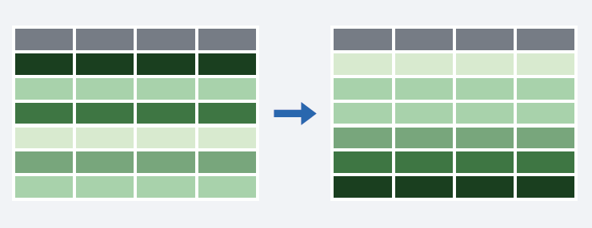
```

- If you pass `arrange()` a character variable, **R** will rearrange the rows in alphabetical order according to values of the variable. 

- If you pass a factor variable, **R** will rearrange the rows according to the order of the levels in your factor (running `levels()` on the variable reveals this order).
---
##Arranging your data
1) Arrange countries in `gapmEU21c` `df` by life expectancy in ascending and descending order.

2) Using `gapminder df`
  - Find the records with the smallest population
  
  - Find the records with the largest life expectancy.
---
##Solution 1):
```{r, echo = TRUE}
gapmEU21c_h2l <- arrange(gapmEU21c, lifeExp)
head(gapmEU21c_h2l, 2)
gapmEU21c_l2h <- arrange(gapmEU21c, desc(lifeExp)) #<<
head(gapmEU21c_l2h, 2)
```
---
##Solution 2):
```{r, echo = TRUE}
arrange(gapminder, pop)
```
---
```{r, echo = TRUE}
arrange(gapminder, desc(lifeExp))
```
---
##Collapse many values down to a single summary: <span style="color:blue">`summarise()`</span>
```{r, out.width = "450px", echo=FALSE}
knitr::include_graphics("summarise().png")
```

- uses the same syntax as `mutate()`, but the resulting dataset consists of a single row instead of an entire new column in the case of `mutate()`. 

- builds a new dataset that contains only the summarising statistics.

Use `summarise()`:

1) to print out a summary of gapminder containing two variables: max_lifeExp and max_gdpPercap.

2) to print out a summary of gapminder containing two variables: mean_lifeExp and mean_gdpPercap.
---
##Solution: Summarise your data

```{r, echo = TRUE}
summarise(gapminder, max_lifeExp = max(lifeExp), max_gdpPercap = max(gdpPercap))
```

```{r, echo = TRUE}
summarise(gapminder, mean_lifeExp = mean(lifeExp), mean_gdpPercap = mean(gdpPercap))
```
---
class: inverse, center, middle

## Let's `%>%` all up!

Confer with your neighbours.

What relationship do you expect to see between population size
(`pop`) and life expectancy (`lifeExp`)?
---

```{r, out.width = "750px", echo=FALSE, fig.align = 'center'}
knitr::include_graphics("pipe_short_cut.png")
```
---
**Do you know what this code does?**
```{r, echo = TRUE, eval = FALSE,  fig.height = 5, fig.width = 8, fig.align = 'center'}
gapminder_pipe <- gapminder %>%
  filter(continent == "Europe" & year ==  2007) %>%
  mutate(pop_e6 = pop / 1000000)
plot(gapminder_pipe$pop_e6, gapminder_pipe$lifeExp, cex = 0.5, col = "red")
```

```{r, out.width = "250px", echo=FALSE, fig.align = 'center'}
knitr::include_graphics("Cosmo.jpg")
```
---
```{r, echo = FALSE,  fig.height = 7, fig.width = 8, fig.align = 'center'}
gapminder_pipe <- gapminder %>%
  filter(continent == "Europe" & year ==  2007) %>%
  mutate(pop_e6 = pop / 1000000)
plot(gapminder_pipe$pop_e6, gapminder_pipe$lifeExp, cex = 0.5, col = "red")
```
---
class: inverse, center, middle

##We have learnt all of Elain's moves!!! 😃🎵🎶

```{r, out.width = "300px", echo=FALSE}
knitr::include_graphics("ElainDanceII.png")
```
---
class: inverse, center, middle

## Can we make it look better? 😁
---
class: inverse, center, middle

#"The simple graph has brought more information to the data analyst’s mind than any other device."
John Tukey
---
## grammar of graphics
Enables you to specify building blocks of a plot and to combine them to create graphical display you want. There are 8 building blocks:

- data

- aesthetic mapping

- geometric object

- statistical transformations

- scales

- coordinate system

- position adjustments

- faceting
---
##<span style="color:blue">ggplot()</span>
1. "Initialise" a plot with `ggplot()`
2. Add layers with `geom_` functions

```{r, echo = TRUE, fig.height = 3, fig.width = 8, fig.align = 'center'}
library(ggplot2)
ggplot(gapminder_pipe, aes(x = pop_e6, y = lifeExp)) +
  geom_point(col ="red")
```
**Tip**: You can use the following code template to make graphs with **ggplot2**:

```{r, eval = FALSE}
ggplot(data = <DATA>, (mapping = aes(<MAPPINGS>)) +
  <GEOM_FUNCTION>()
```
---
#<span style="color:blue">ggplot()</span> gallery
Run the following code to see what graphs it's going to produce.

```{r, echo = TRUE, eval = FALSE, warnings=FALSE, message=FALSE}
ggplot(data = gapminder, mapping = aes(x = lifeExp), binwidth = 10) +
  geom_histogram()
#
ggplot(data = gapminder, mapping = aes(x = lifeExp)) +
  geom_density()
#
ggplot(data = gapminder, mapping = aes(x = continent, color = continent)) +
  geom_bar()
#
ggplot(data = gapminder, mapping = aes(x = continent, fill = continent)) +
  geom_bar()
```
---
##Confer with your neighbours:

**Does the life expectancy depend upon the population size?**
$$\hat{y}=\hat{\beta_0} + \hat{\beta_1} x + e$$
Run this code in your console to fit the model `pop` vs `lifeExp`.

Pay attention to spelling, capitalization, and
parentheses!
```{r, echo = TRUE, eval=FALSE, warning= FALSE}
m1 <- lm(gapminder_pipe$lifeExp ~ gapminder_pipe$pop_e6)
summary(m1)
```
---
**Can you answer the question usig the output of the fitted model?**
```{r, echo = TRUE, warning= FALSE}
m1 <- lm(gapminder_pipe$lifeExp ~ gapminder_pipe$pop_e6)
summary(m1)
```
---
## Your turn!

Use gapminder data.

**Does the life expectancy depend upon the GDP per capita?**

1) Have a glance at the data. (tip: `sample_n(df, n)`)

2) Produce a scattep plot: what does it tell you?

3) Fit a regression model: is there a relationship? How strong is it?
Is the relationship linear? What conclusion(s) can you draw?

4) What are the other questions you could ask; could you provide the answers to them?
---
## Possible Solution: code Q1; sample
```{r, echo = TRUE, warning= FALSE}
sample_n(gapminder, 30)
```
---
## Possible Solution: code Q2; Plot the data;
```{r, echo = TRUE, warning= FALSE, fig.height = 4, fig.width = 8, fig.align = 'center'}
ggplot(gapminder, aes(x = gdpPercap, y = lifeExp)) +
    geom_point(alpha = 0.2, shape = 21, fill = "blue", colour="black", size = 5) +
  geom_smooth(method = "lm", se = F, col = "maroon3") +
  geom_smooth(method = "loess", se = F, col = "limegreen") 
```
---
## Possible Solution: code Q3; simple regression model
```{r, echo = TRUE, warning= FALSE}
my.model <- lm(gapminder_pipe$lifeExp ~ gapminder_pipe$gdpPercap)
summary(my.model)
```
---
## Adding layers to your <span style="color:blue">`ggplot()`</span>

```{r, echo = TRUE, eval = FALSE}
ggplot(gapminder, aes(x = gdpPercap, y = lifeExp, col = "red")) +
      geom_point(alpha = 0.2, shape = 21, fill = "blue", colour="black", size = 5) +
  geom_smooth(method = "lm", se = F, col = "maroon3") +
  geom_smooth(method = "loess", se = F, col = "limegreen") +
  labs (title= "Life Exp. vs. Population Size", 
        x = "population", y = "Life Exp.") +
  theme(legend.position = "none", 
        panel.border = element_rect(fill = NA, 
                                    colour = "black",
                                    size = .75),
        plot.title=element_text(hjust=0.5)) +
  geom_text(x = 80000, y = 125, label = "regression line", col = "maroon3") +
  geom_text(x = 90000, y = 75, label = "smooth line", col = "limegreen")
```
---
## Voila
```{r, echo = FALSE, warnings=FALSE, message=FALSE, fig.height = 6, fig.width = 8, fig.align = 'center'}
ggplot(gapminder, aes(x = gdpPercap, y = lifeExp, col = "red")) +
      geom_point(alpha = 0.2, shape = 21, fill = "blue", colour="black", size = 5) +
  geom_smooth(method = "lm", se = F, col = "maroon3") +
  geom_smooth(method = "loess", se = F, col = "limegreen") +
  labs (title= "Life Exp. vs. Population Size", 
        x = "population", y = "Life Exp.") +
  theme(legend.position = "none", 
        panel.border = element_rect(fill = NA, 
                                    colour = "black",
                                    size = .75),
        plot.title=element_text(hjust=0.5)) +
  geom_text(x = 80000, y = 125, label = "regression line", col = "maroon3") +
  geom_text(x = 90000, y = 75, label = "smooth line", col = "limegreen")

```
---
## **There is a challenge:** 

- `dplyr`'s `group_by()` function enables you to group your data. It allows you to create a separate df that splits the original df by a variable.

- `boxplot()` function produces boxplot(s) of the given (grouped) values.

Knowing about `group_by()` and `boxplot()` function, coud you compute the median life expectancy for year 2007 by continent and visualise your result?
---
## Possible Solution: 

Let us look at the median life expectancy for each continent
```{r, echo = TRUE}
gapminder %>%
    group_by(continent) %>%
    summarise(lifeExp = median(lifeExp))
```


**We are lucky that we live in Serbia, ie. Europe!!!**
---
## Possible Solution: 
```{r, echo = TRUE, eval = FALSE, warnings=FALSE, message=FALSE, fig.height = 6, fig.width = 8, fig.align = 'center'}
# visualise the information code
library("ggplot2")
ggplot(gapminder, aes(x = continent, y = lifeExp)) +
  geom_boxplot(outlier.colour = "hotpink") +
  geom_jitter(position = position_jitter(width = 0.1, height = 0), alpha = .2) +
  labs (title= "Life Exp. vs. Continent", 
        x = "Continent", y = "Life Exp.") +
  theme(legend.position = "none", 
        panel.border = element_rect(fill = NA, 
                                    colour = "black",
                                    size = .75),
        plot.title=element_text(hjust=0.5))
```
---
## Possible Solution: graph
```{r, echo = FALSE, warnings=FALSE, message=FALSE, fig.height = 6, fig.width = 8, fig.align = 'center'}
# visualise the information
library("ggplot2")
ggplot(gapminder, aes(x = continent, y = lifeExp)) +
  geom_boxplot(outlier.colour = "hotpink") +
  geom_jitter(position = position_jitter(width = 0.1, height = 0), alpha = .2) +
  labs (title= "Life Exp. vs. Continent", 
        x = "Continent", y = "Life Exp.") +
  theme(legend.position = "none", 
        panel.border = element_rect(fill = NA, 
                                    colour = "black",
                                    size = .75),
        plot.title=element_text(hjust=0.5))
```
---
class: inverse, center, middle

##Let's do Elain's Dance!!! 😃🎵🎶

```{r, out.width = "500px", echo=FALSE}
knitr::include_graphics("Elain_dance.gif")
```
---
## useful links: 

cheatsheets:

- [data-wrangling-cheatsheet](https://www.rstudio.com/wp-content/uploads/2015/02/data-wrangling-cheatsheet.pdf)

- [ggplot2-cheatsheet](https://www.rstudio.com/wp-content/uploads/2015/03/ggplot2-cheatsheet.pdf)

websites:

- [tidyverse, visualization, and manipulation basics](https://www.rstudio.com/resources/webinars/tidyverse-visualization-and-manipulation-basics/)

- [ggplot part of tidy verse](http://ggplot2.tidyverse.org/index.html)

- [Introduction to R graphics with ggplot2](http://tutorials.iq.harvard.edu/R/Rgraphics/Rgraphics.html#introduction)
---
class: inverse, center, middle

#ENTER
#R Workshop: part II
##Tatjana Kecojevic
##26 April 2018
---
#R Markdown 💻📊📈📃


Enables you to:
- save and execute code and display its output
- create high quality reports that could include [LaTeX](https://www.latex-project.org/) equations

[R Markdown](https://rmarkdown.rstudio.com/) documents are fully reproducable and support many static and dynamic output formts, to name a few: PDF, HTML, MS Word, Beamer... 

It is a variant of [Markdown](https://daringfireball.net/projects/markdown/) that has embedded **R code chunks** (denoted by three backticks), to be used with [knitr](https://yihui.name/knitr/) to make it easy to create reproducible web-based reports. 

To use **R Markdown** you will need to install package from [CRAN](https://cran.r-project.org/) and load it with:

```{r eval=FALSE, warnings=FALSE, message=FALSE}
install.packages("rmakdown",repos = "http://cran.us.r-project.org")
suppressPackageStartupMessages(library(rmarkdown))
```
---
class: middle

```{r, out.width = "1000px", echo=FALSE}
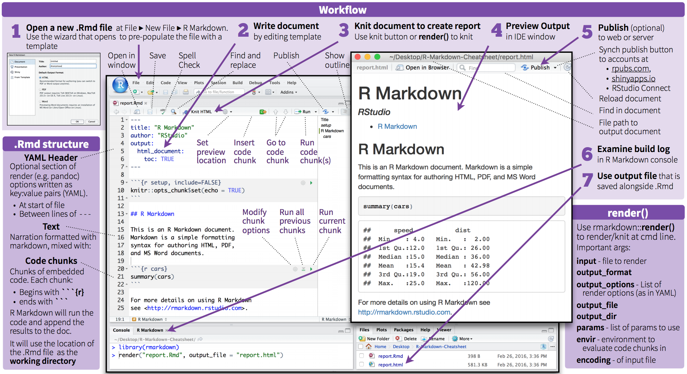
```

You would deffinitely find usefull the following:

- [The R Markdown Cheatsheet](https://ntaback.github.io/UofT_STA130/rmarkdown-2.0.pdf)

- [The R Markdown Reference Guide](https://www.rstudio.com/wp-content/uploads/2015/03/rmarkdown-reference.pdf)
---
#Starting with RMarkdown

**<span style="color:red">Task 1</span>:**
Open the file `RMarkdown_Intro.Rmd`

- Change the title of the Markdown Document from `My First Markdown Document` to `RMarkdown Introduction`.

-  Click the **"Knit"** button to see the compiled version of your sample code.
---
class: inverse, center, middle

##Congratulations! You’ve just Knitted your $1^{st}$ Rmd document!!!! 👍😃

```{r, out.width = "300px", echo=FALSE}
knitr::include_graphics("kramer_congrats.gif")
```
---
## Basic Text editing

**<span style="color:red">Task 2</span>:**
Let’s formatted this document further by

- Changing the author of the document to your own name.

- Rewriting the first sentence of the document to say "This is my first R Markdown document."

- Recompiling the document so you can see your changes?
---
##Adding a link

You can turn a word into a link by surrounding it in **hard brackets: [ ]** and then placing the link behind it in **parentheses: ( )**, like this:

[RStudio] (www.rstudio.com)

**<span style="color:red">Task 3</span>:**
Make GitHub in the following paragraph link to https://github.com/TanjaKec/ENTER
---
#Text formatting 

To embed formatting instructions into your document using Markdown, you
would surround text by:
- one asterisks to make it italic: *italic*;
- two asterisks to make it bold: **bold** and
- backticks to make it monospaced: `monospaced`.

To make an ordered list you need to place each item on a new line after a
number followed by a period followed by a space:
1. order list
2. item 2
Note that you need to place a blank line between the list and any paragraphs
that come before it.
---
##**<span style="color:red">Task 4</span>:**

- Make the following paragraph in your Rmd document look like this:

The variables can be one of two broad types:

1) **Attribute variable**: has its outcomes described in terms of its characteristics or
attributes;

2) **Measured variable**: has the resulting outcome expressed in numerical terms.

- Make word Knit in the following paragraph bold.
---
#Embeding the `R` code 
To embed an R code chunk you would use three back ticks:

` ```{r} `

` chunk of code`

` ``` `

**<span style="color:red">Task 5</span>**: Replace the `cars` data set with the `gapminder` data set.

You can also embed plots by setting `echo = FALSE` to the code chunk to
prevent printing of the R code that generates the plot:

` ```{r, echo=FALSE} `

` chunk of code`

` ``` `

**<span style="color:red">Task 6</span>**: Replace the base boxplot of mpg vs. cyl by a ggplot's boxplot to examine a relationship between `continent` and `lifeExp` (remember to use some of the `dplyr` functions too!).
---
##Adding **LaTex** equations

Finally, if you wish to add mathematical equations to your Markdown
document you can easily embed LaTeX math equations into your report.

To display equation in its own line it needs to be surrounded by double dollar
symbol `$$` `y = a + bx` `$$`, or to embed an equation in line within the text you
would use only one dollar symbol: `$y = a + bx$`.

**<span style="color:red">Task 7</span>**: Display the equation into it’s own line.
---
class: inverse, center, middle

#Congratulations! You have got the basics to start creating your own fabulous dynamic documents… !!!! 👍😃

```{r, out.width = "300px", echo=FALSE}
knitr::include_graphics("giphy.gif")
```
---
class: inverse, center, middle

#Let's Shiny with R 
## 🌞😎🤩
---
##What is Shiny?

**Shiny** is a package from [RStudio](https://www.rstudio.com) that can be used to build interactive web apps with `R`. 

You can host standalone apps on a webpage or embed them in [R Markdown](https://rmarkdown.rstudio.com) documents or build [dashboards](http://rstudio.github.io/shinydashboard/. You can also extend your Shiny apps with [CSS themes](http://rstudio.github.io/shinythemes/), [htmlwidgets](http://www.htmlwidgets.org), and [JavaScript actions](https://github.com/daattali/shinyjs/blob/master/README.md).

Shiny combines the computational power of R with the interactivity of the modern web.

Shiny apps are easy to write. No web development skills are required.
---
##How does it work?
```{r, out.width = "700px", echo=FALSE, fig.align = 'center'}
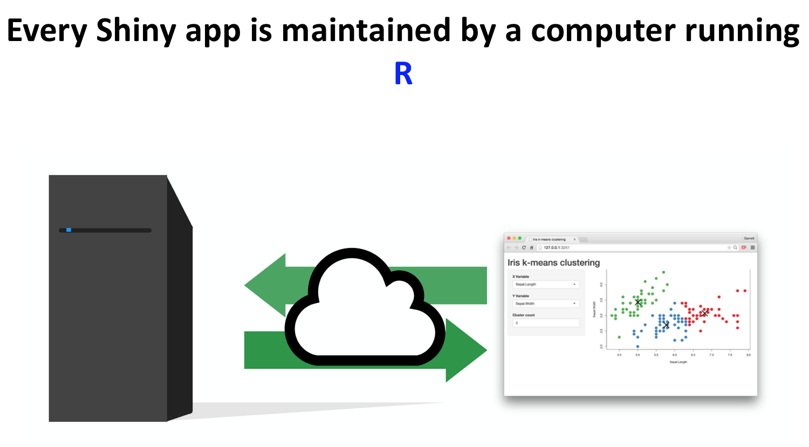
```
---
##There are two elements
```{r, out.width = "700px", echo=FALSE, fig.align = 'center'}
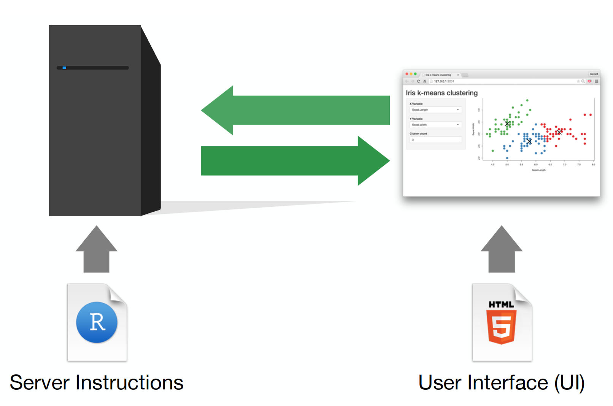
```
---
##Template
```{r, out.width = "700px", echo=FALSE, fig.align = 'center'}
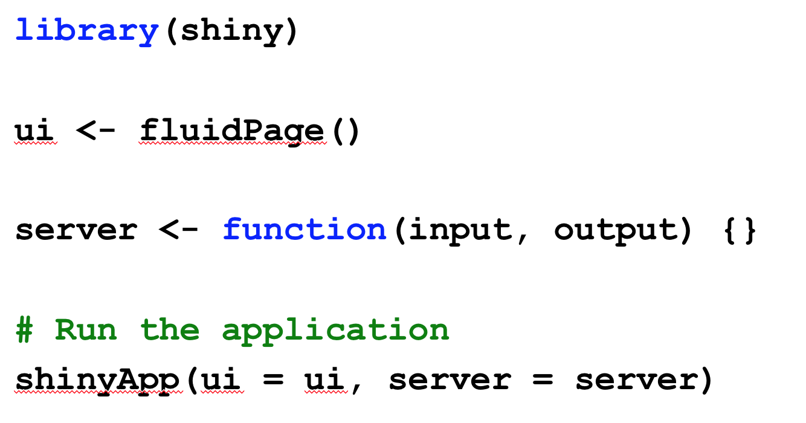
```
---
##Run & Stop
```{r, out.width = "700px", echo=FALSE, fig.align = 'center'}
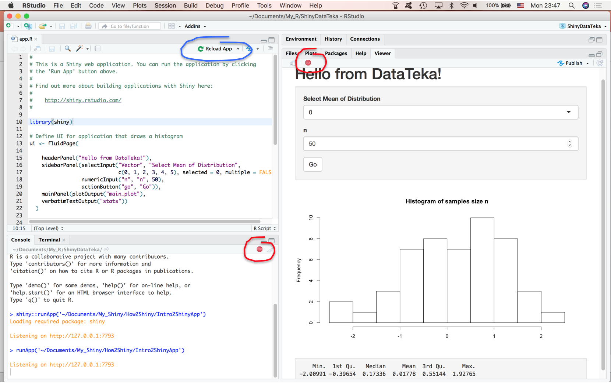
```
---
##UI: Inputs & Outputs
```{r, out.width = "700px", echo=FALSE, fig.align = 'center'}
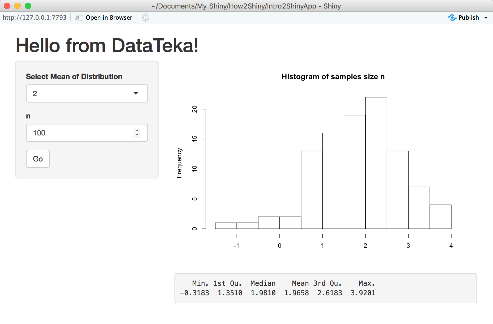
```
---
##Structure
```{r, out.width = "650px", echo=FALSE, fig.align = 'center'}
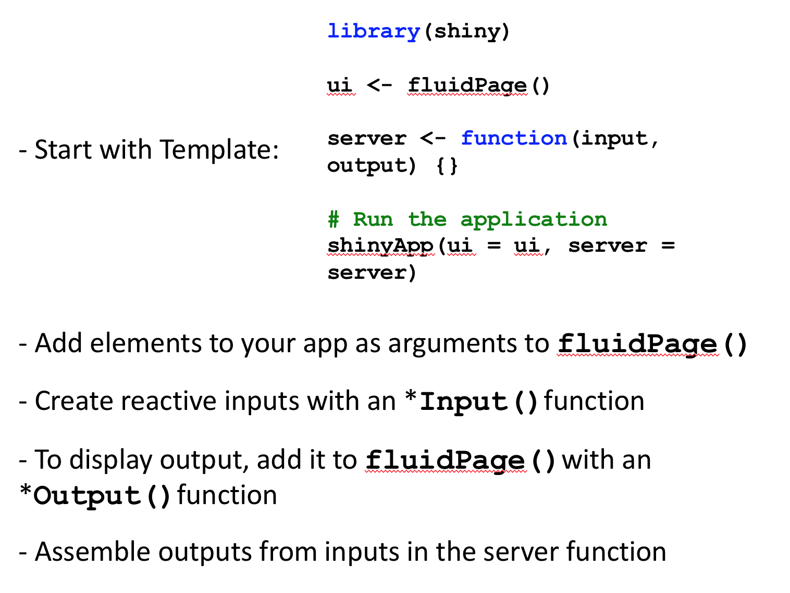
```
---
class: inverse, center, middle
##Do the Cosmo Dance?! 🤪🎵🎶
```{r, out.width = "500px", echo=FALSE}
knitr::include_graphics("Cosmo_Dance.gif")
```
---
##<https://tatjana.shinyapps.io/Gapminder/>
```{r, out.width = "750px", echo=FALSE, fig.align = 'center'}
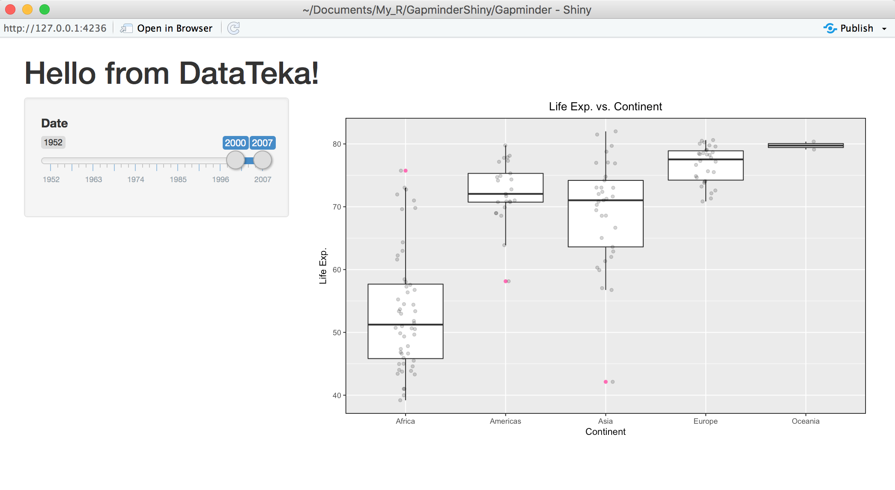
```
---
##💻📊📈📃🤓🤪🤩😎
**Useful Links**:  

R Markdown:
<http://www.stat.cmu.edu/~cshalizi/rmarkdown/>

Shiny Cheatsheet:
<https://shiny.rstudio.com/images/shiny-cheatsheet.pdf>

Shiny Showcase:
<https://www.rstudio.com/products/shiny/shiny-user-showcase/>

Teach yourself Shiny:
<https://shiny.rstudio.com/tutorial/>

[RStudio Cheatsheets](https://www.rstudio.com/resources/cheatsheets/)

```{r, out.width = "300px", echo=FALSE, fig.align = 'center'}
knitr::include_graphics("SeinfeldDance.gif")
```

---

class: center, middle

# Thanks!

Please provide a feedback by filling the form:
<https://tatjana.shinyapps.io/ENTER_Form>

[www.datateka.com](www.datateka.com) 

[tanjakec.github.io](tanjakec.github.io)

@DataTeka 

@Tatjana_Kec


Slides created via the R package [**xaringan**](https://github.com/yihui/xaringan).

The chakra comes from [remark.js](https://remarkjs.com), [**knitr**](http://yihui.name/knitr), and [R Markdown](https://rmarkdown.rstudio.com).
